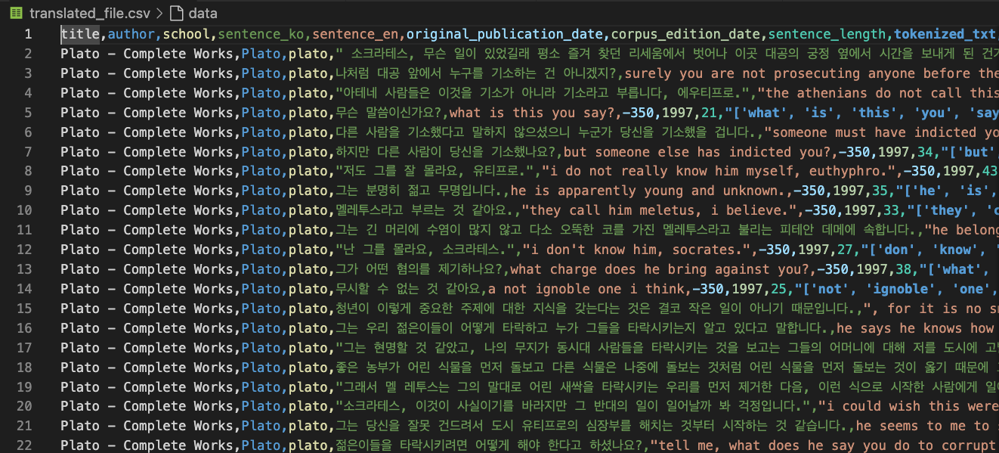

# philosopher-lines-database-design-using-RDBMS

- 고대~근대 철학자들의 인용문으로 RDBMS 설계하기

## Data Source

- [프로젝트 구텐베르크](https://www.gutenberg.org/)를 이용한 카글의 철학 데이터셋
- This dataset is originally sourced from Project Gutenberg and privately owned PDFs as mentioned in the
  [Kaggle dataset page](https://www.kaggle.com/datasets/kouroshalizadeh/history-of-philosophy/data).

## 전처리 후의 **초기** 데이터 구조

- 360808개의 인용문 -> 학자당 25개 제한 & 너무 많은 학파의 경우 제거해서 825개로 축소함
- DeepL API 이용해서 한국어로 번역한 컬럼 sentence_ko 생성



- philosophy 스키마
  - philosopher_lines 테이블
    - title: 철학자 저서의 제목
    - author: 저자 이름
    - school: 철학 학파
    - sentence_ko: 한국어 문장
    - sentence_en: 영어 문장
    - original_publication_date: 원본 출판일
    - corpus_edition_date: 말뭉치 에디션 날짜
    - sentence_length: 문장 길이
    - tokenized_txt: 토큰화된 텍스트
    - lemmatized_str: 원형화된 문자열

## 1. 데이터베이스 설계 다이어그램(ERD)


1. Philosophers 테이블

   • Primary Key: id (INT, AUTO_INCREMENT)

   • Foreign Key: school_id가 philosophical_schools 테이블의 id를 참조

2. Philosophical Schools 테이블

   • Primary Key: id (INT, AUTO_INCREMENT)

3. Philosophical Works 테이블

   • Primary Key: id (INT, AUTO_INCREMENT)

   • Foreign Key: author_id가 philosophers 테이블의 id를 참조

4. Philosopher Lines 테이블

   • Primary Key: id (INT, AUTO_INCREMENT)

   • Foreign Key: author_id가 philosophers 테이블의 id를 참조

## 2. MySQL 설정 및 데이터베이스 생성 스크립트


(csv파일의 인코딩을 인식하지 못해서 json으로 변경 후 진행)

### 스키마 및 테이블 생성 과정

### 0. philosophy 스키마 생성

### 1. 첫 테이블 philosopher_lines;


### 2. 철학자 테이블 생성

```sql
CREATE TABLE IF NOT EXISTS philosophers (
    id INT AUTO_INCREMENT PRIMARY KEY,
    name VARCHAR(255) NOT NULL UNIQUE,
    school_id INT,
    FOREIGN KEY (school_id) REFERENCES philosophical_schools(id)
);
```

### 3. 철학 학파 테이블 생성

```sql
CREATE TABLE IF NOT EXISTS philosophical_schools (
    id INT AUTO_INCREMENT PRIMARY KEY,
    school_name VARCHAR(255) NOT NULL UNIQUE
);
```

### 4. 철학 저서 테이블 생성 (DATE를 INT로 변경)

```sql
CREATE TABLE IF NOT EXISTS philosophical_works (
    id INT AUTO_INCREMENT PRIMARY KEY,
    title VARCHAR(255) NOT NULL,
    author_id INT,
    original_publication_date INT,
    corpus_edition_date INT,
    FOREIGN KEY (author_id) REFERENCES philosophers(id)
);
```

### 5. 처음에 생성했던 철학자 인용문에서 불필요한 컬럼들 삭제, id PK 설정 등 수정

```sql
ALTER TABLE philosopher_lines
ADD COLUMN id INT AUTO_INCREMENT PRIMARY KEY;

ALTER TABLE philosopher_lines
ADD COLUMN author_id INT,
ADD FOREIGN KEY (author_id) REFERENCES philosophers(id);
-- ...
```


## 3. CRUD 작업을 수행하는 SQL 스크립트

### Create

#### 1.

```sql
-- 철학 학파 테이블에 데이터 삽입
INSERT IGNORE INTO philosophical_schools (school_name)
SELECT DISTINCT school FROM philosopher_lines
WHERE school IS NOT NULL AND school != '';
```

#### 2.

```sql
-- 철학자 테이블에 데이터 삽입
INSERT INTO philosophers (name)
SELECT DISTINCT author FROM philosopher_lines;
```

#### 3.

```sql
-- 철학자 테이블에 school_id 데이터 삽입
UPDATE philosophers p
JOIN philosopher_lines pl ON p.name = pl.author
JOIN philosophical_schools ps ON pl.school = ps.school_name
SET p.school_id = ps.id;
```

#### 4.

```sql
-- 철학 저서 테이블에 데이터 삽입
INSERT INTO philosophical_works (title, author_id, original_publication_date, corpus_edition_date)
SELECT DISTINCT pl.title, ph.id, pl.original_publication_date, pl.corpus_edition_date
FROM philosopher_lines pl
JOIN philosophers ph ON pl.author = ph.name;
```

### Read

#### 1.

```sql
-- 철학자 인용문 조회
SELECT * FROM philosophy.philosopher_lines;
```


#### 2.

```sql
-- 철학자 테이블 조회
SELECT * FROM philosophy.philosophers;
```


#### 3.

```sql
-- 철학 학파 테이블 조회
SELECT * FROM philosophy.philosophical_schools;
```


#### 4.

```sql
-- 철학 저서 테이블 조회
SELECT * FROM philosophy.philosophical_works;
```


### Update

#### 1.

```sql
-- 철학자 이름 수정
UPDATE philosophers
SET name = 'Too idealistic man'
WHERE id = 1;
```


#### 2.

```sql
-- 철학 저서 제목 수정
UPDATE philosophical_works
SET title = 'Not worth reading nowdays'
WHERE id = 1;
```

### Delete

#### 1.

```sql
-- 철학자 데이터 삭제
DELETE FROM philosophers
WHERE id = 1;
```

#### 2.

```sql
-- 철학 저서 데이터 삭제
DELETE FROM philosophical_works
WHERE id = 1;
```

### 추가 수정

원본 데이터의 컬럼명
original_publication_date, corpus_edition_date
를 내용(1997, -350, ...)를 반영해 date에서 year로 수정함.

## 4. 인덱스 및 쿼리 최적화 스크립트

### 인덱스 추가해보자

```sql
-- 철학자 테이블에 인덱스 추가
CREATE INDEX idx_philosophers_name ON philosophers(name);
CREATE INDEX idx_philosophers_school_id ON philosophers(school_id);

-- 철학 저서 테이블에 인덱스 추가
CREATE INDEX idx_philosophical_works_title ON philosophical_works(title);
CREATE INDEX idx_philosophical_works_author_id ON philosophical_works(author_id);
CREATE INDEX idx_philosophical_works_publication_year ON philosophical_works(original_publication_year);

-- 철학 학파 테이블에 인덱스 추가
CREATE INDEX idx_philosophical_schools_name ON philosophical_schools(school_name);
```

## 5. 성능 테스트 및 분석 보고서

전: 인덱스 없이 SET profiling=1; 로 쿼리


후: 인덱스 사용


## 6. 기능 시연 영상

![[Demo Video]](https://youtu.be/gs6HUsVfLJs?si=j41i7XpyJqKlj8QC)
